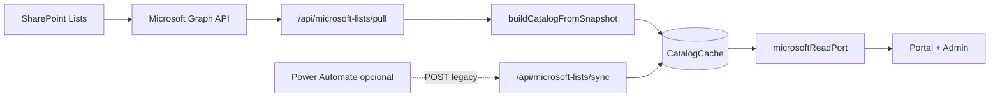

# Plan mínimo: Sync SharePoint desde código (Microsoft Graph)

**Objetivo:** Dejar de depender de Power Automate para llenar `CatalogCache`. Next.js lee las 4 listas de SharePoint con Graph API, reutiliza `buildCatalogFromSnapshot`, y el portal sigue leyendo con `ACADEMIC_SERVICES_DATA_PROVIDER=microsoft`.

**Sitio UTPL:** `https://utpl.sharepoint.com/sites/Encuestasdesatisfaccin`  
**Cache key:** `services-portal-v2`

---

## Arquitectura



**Principio:** Una sola fuente de verdad del mapeo: `catalog-cache.ts`. Pull y POST (PA) convergen ahí.

---

## Fase A — Azure AD (una vez, con TI UTPL)

- [ ] **A.1** En [Azure Portal](https://portal.azure.com) → Microsoft Entra ID → **App registrations** → New registration.
  - Nombre: `campus360-hub-sharepoint-sync`
  - Tipo: solo esta organización (single tenant)
- [ ] **A.2** **Certificates & secrets** → New client secret → guardar valor (solo se muestra una vez).
- [ ] **A.3** **API permissions** → Add → Microsoft Graph → **Application permissions**:
  - `Sites.Read.All` (leer listas del sitio)
  - (Opcional futuro escritura) `Sites.ReadWrite.All`
- [ ] **A.4** **Grant admin consent** para el tenant UTPL.
- [ ] **A.5** Anotar:
  - `Tenant ID` (Directory ID)
  - `Application (client) ID`
  - `Client secret`

**Alternativa más restrictiva:** permiso delegado + usuario de servicio (más complejo). Para sync servidor a servidor, application permission es lo habitual.

---

## Fase B — Variables de entorno

Añadir a `.env.example` y Vercel (Production):

```env
# Graph pull sync (servidor)
MICROSOFT_TENANT_ID=
MICROSOFT_CLIENT_ID=
MICROSOFT_CLIENT_SECRET=
# Ruta del sitio (sin dominio), ej: /sites/Encuestasdesatisfaccin
MICROSOFT_SHAREPOINT_SITE_PATH=/sites/Encuestasdesatisfaccin
# Host del tenant, ej: utpl.sharepoint.com
MICROSOFT_SHAREPOINT_HOST=utpl.sharepoint.com

# Secreto para invocar pull (cron o botón admin) — distinto del webhook PA
MICROSOFT_SYNC_CRON_SECRET=

# Lectura portal (sin cambios)
ACADEMIC_SERVICES_DATA_PROVIDER=microsoft
MICROSOFT_PROVIDER_MODE=cache
MICROSOFT_CATALOG_CACHE_KEY=services-portal-v2
```

---

## Fase C — Archivos a crear / modificar

| Acción | Ruta |
|--------|------|
| Crear | `lib/academic-services/providers/microsoft/graph-client.ts` — token client_credentials + `graphFetch` |
| Crear | `lib/academic-services/providers/microsoft/sharepoint-lists.ts` — IDs de listas, `fetchListItems(listName)` |
| Crear | `lib/academic-services/providers/microsoft/pull-snapshot.ts` — arma `MicrosoftListsSnapshot` desde 4 listas |
| Crear | `lib/academic-services/providers/microsoft/save-catalog-cache.ts` — upsert Prisma (extraer de `sync/route.ts`) |
| Crear | `app/api/microsoft-lists/pull/route.ts` — `POST` sync completo desde Graph |
| Modificar | `app/api/microsoft-lists/sync/route.ts` — reutilizar `save-catalog-cache` (DRY) |
| Modificar | `.env.example` — variables Graph |
| Crear | `tests/lib/academic-services/providers/microsoft-graph-pull.test.ts` — mock fetch, snapshot |
| Crear | `scripts/sync-sharepoint-catalog.ts` — CLI local: `pnpm sync:sharepoint` |
| Modificar | `package.json` — script `"sync:sharepoint"` |

**No tocar** (reutilizar tal cual):

- `lib/academic-services/providers/microsoft/catalog-cache.ts`
- `lib/academic-services/providers/microsoft/read-port.ts`

---

## Fase D — Implementación (orden para el agente)

### D.1 `graph-client.ts`

- [ ] `getGraphAccessToken()` — POST `https://login.microsoftonline.com/{tenant}/oauth2/v2.0/token` con `client_credentials`, scope `https://graph.microsoft.com/.default`.
- [ ] Cache en memoria del token (~50 min TTL).
- [ ] `graphGet(path)` — GET `https://graph.microsoft.com/v1.0{path}` con Bearer.

### D.2 Resolver sitio SharePoint

- [ ] `getSiteId()` — una vez por ejecución:

```http
GET /sites/{hostname}:/{site-path}
```

Ejemplo path: `/sites/utpl.sharepoint.com:/sites/Encuestasdesatisfaccin`  
(o formato documentado: `GET /sites/utpl.sharepoint.com:/sites/Encuestasdesatisfaccin`)

- [ ] Guardar `site.id` para siguientes llamadas.

### D.3 Leer ítems de cada lista

Nombres de lista en SharePoint (display name → clave interna):

| Lista SharePoint | Clave en snapshot |
|----------------|-------------------|
| StudentTypes | `studentTypes` |
| ServiceCategories | `serviceCategories` |
| Services | `services` |
| ServiceRequirements | `serviceRequirements` |

- [ ] Por cada lista:

```http
GET /sites/{site-id}/lists/{list-id}/items?expand=fields&$top=5000
```

- [ ] Resolver `list-id` con:

```http
GET /sites/{site-id}/lists?$filter=displayName eq 'Services'
```

(o mantener IDs fijos en env `MICROSOFT_LIST_ID_SERVICES=...` si UTPL los proporciona — más rápido y estable).

- [ ] Mapear cada ítem Graph `fields` → fila plana compatible con `catalog-cache`:
  - `fields.Title` → `Title`
  - `fields.field_1` … `fields.field_13` (nombres internos SharePoint; verificar con una muestra real vía Graph explorer)

### D.4 `pull-snapshot.ts`

```ts
export async function pullMicrosoftListsSnapshot(): Promise<MicrosoftListsSnapshot>
```

- [ ] Llama las 4 listas en paralelo (`Promise.all`).
- [ ] Devuelve objeto listo para `buildCatalogFromSnapshot(snapshot)`.

### D.5 `save-catalog-cache.ts`

```ts
export async function saveCatalogCache(cacheKey: string, snapshot: MicrosoftListsSnapshot)
```

- [ ] `catalog = buildCatalogFromSnapshot(snapshot)`
- [ ] `prisma.catalogCache.upsert` (misma lógica que `sync/route.ts` POST hoy).

### D.6 `app/api/microsoft-lists/pull/route.ts`

- [ ] `POST` protegido con header `x-sync-secret: MICROSOFT_SYNC_CRON_SECRET` (o sesión admin futura).
- [ ] `pullMicrosoftListsSnapshot()` → `saveCatalogCache(cacheKey)`.
- [ ] Respuesta JSON:

```json
{
  "ok": true,
  "cacheKey": "services-portal-v2",
  "sources": { "studentTypes": 11, "serviceCategories": 7, "services": 5, "serviceRequirements": 9 },
  "catalog": { "studentTypes": 11, "categories": 7, "services": 5 }
}
```

- [ ] `GET` opcional: estado + último `updatedAt` (sin secret).

### D.7 Script CLI

```bash
pnpm sync:sharepoint
# llama pull-snapshot + save-catalog-cache con --env-file=.env.local
```

Útil para desarrollo sin exponer endpoint.

### D.8 Cron en Vercel (opcional)

- [ ] `vercel.json` cron cada 15–60 min:

```json
{ "crons": [{ "path": "/api/microsoft-lists/pull", "schedule": "0 */6 * * *" }] }
```

- [ ] Vercel Cron envía request; validar con `CRON_SECRET` o `MICROSOFT_SYNC_CRON_SECRET`.

---

## Fase E — Verificación

- [ ] `pnpm vitest run tests/lib/academic-services/providers/microsoft-graph-pull.test.ts`
- [ ] Local: `pnpm sync:sharepoint` → sin error.
- [ ] `GET /api/microsoft-lists/sync?cacheKey=services-portal-v2` → `serviceCount > 0`.
- [ ] Portal con `ACADEMIC_SERVICES_DATA_PROVIDER=microsoft` muestra servicios.
- [ ] Comparar conteos con SharePoint (mismo número de filas activas).

---

## Fase F — Power Automate (opcional después)

- [ ] Desactivar flujos PA de sync completo, o dejar solo trigger “aviso” que llame `POST /api/microsoft-lists/pull` con secret (más simple que 4 flujos Select).
- [ ] Mantener `POST /api/microsoft-lists/sync` por compatibilidad un tiempo.

---

## Mapeo columnas (recordatorio)

En SharePoint las columnas custom suelen ser `field_1`… en Graph `fields.field_1`.

**Services:** `field_1` = slug categoría (`servicios-practicum`), no nombre visible.

**Categorías:** `Title` = slug, `field_5` = código tipo estudiante (`PREGRADO`).

`catalog-cache.ts` ya normaliza `Title` + `field_N` si llegan crudas; si Graph devuelve `fields` con otros nombres, ajustar en `sharepoint-lists.ts` un `normalizeGraphFields(fields)`.

---

## Definición de terminado

- [ ] Un comando o endpoint llena `CatalogCache` sin Power Automate.
- [ ] `catalog.services.length >= 1` en producción.
- [ ] Secretos solo en Vercel / `.env.local`, nunca en repo.
- [ ] Tests con mock de Graph (sin llamar UTPL en CI).

---

## Prompt copiable para agente implementador

```
Implementa el plan en docs/superpowers/plans/2026-05-22-sharepoint-graph-pull-sync.md.

Orden: graph-client → sharepoint-lists → pull-snapshot → save-catalog-cache → pull/route.ts → script sync:sharepoint → tests.

Reutiliza buildCatalogFromSnapshot. No rompas POST /api/microsoft-lists/sync.

Cache key: services-portal-v2. Site: /sites/Encuestasdesatisfaccin en utpl.sharepoint.com.

Al terminar: ejecutar tests y documentar en README una sección corta "Sync SharePoint (Graph)".
```
